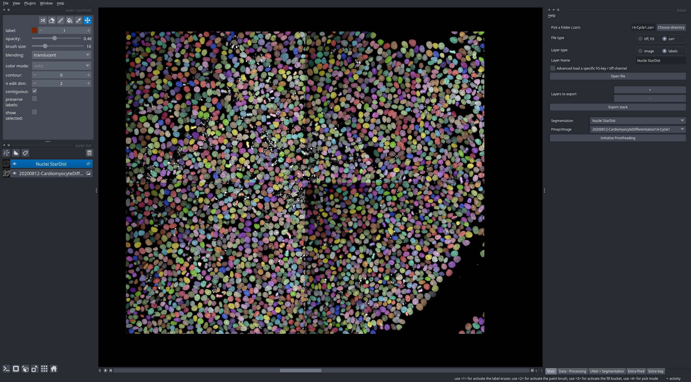

# StarDist-Zarr-RSE-exercise-
Take home exercise for the RSE position

## Task details
* Use stardist to segment the nuclei in the DAPI channel of the provided zarr file (https://zenodo.org/records/10257532).
* (Optional) Try also alternative methods for segmentation (e.g. PlantSeg)
* Write a Python script that performs the segmentation and saves the results as a zarr file.
* The script should be configurable via config file (yaml or json).
* All relevant parameters should be configurable via the config file.
* The project should be pip installable.

## Main Objectives
* Release a clear and usable python package, with a nice API.
* The package should work for OME-Zarr files.
* Support for multi-resolution data.


## Installation
* create a conda environment
```bash
mamba create -n zarrdist python=3.11 -c conda-forge numpy matplotlib notebook ome-zarr tensorflow-gpu  
```
* activate the environment
```bash
mamba activate zarrdist
```
* install the package and stadist 
```bash
pip install .
```

* [optional] download the test data from [Zenodo](https://zenodo.org/record/10257532/files/20200812-CardiomyocyteDifferentiation14-Cycle1.zarr)


## Usage as a CLI
* Run the script
```bash
python stardist_zarr/main.py --config ./sample_config.yaml    
```

### Config file example
```yaml
input_files: # List of input files to process 
  - path: "./20200812-CardiomyocyteDifferentiation14-Cycle1.zarr" # Path to the input file
    plate_to_segment: "B/03/0"                                    # Plate to segment
    target_channel: 0                                             # DAPI channel
    output_name: "nuclei_stadist"                                 # Output file name to save inside the OME-Zarr file label

pipeline: # Main parameters for the segmentation pipeline
  model_name: 2D_versatile_fluo                                  # Model name to use for the segmentation
  min_size: 1000                                                 # Minimum size of the objects to keep in the segmentation mask after stardist(in pixels)
  threshold: 0.5                                                 # threshold for the overlap (overlap measured as intersection over Min)
  ## Secondary {Optional} parameters
  image_normalization_kwargs:                                    # Image normalization parameters
    pmax: 90                                                     # Percentile max
  cellpose_kwargs:                                               # Cellpose parameters
```

## Usage as a Python package
```python
from stardist_zarr.pipeline import stardist2D_stacked

input_config = {'path': "./20200812-CardiomyocyteDifferentiation14-Cycle1.zarr",
                'plate_to_segment': "B/03/0",
                'target_channel': 0,
                'output_name': "nuclei_stadist"
                }

stardist2D_stacked(input_config,
                   model_name='2D_versatile_fluo',
                   min_size=1000,
                   threshold=0.5,
                   )
```

### Example output

